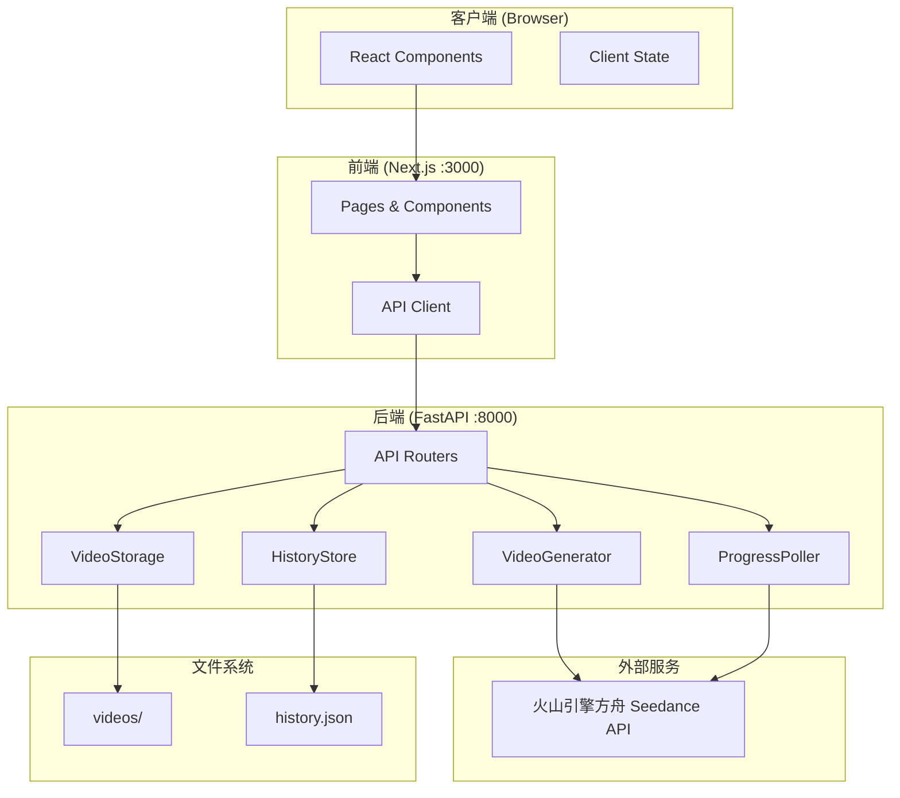
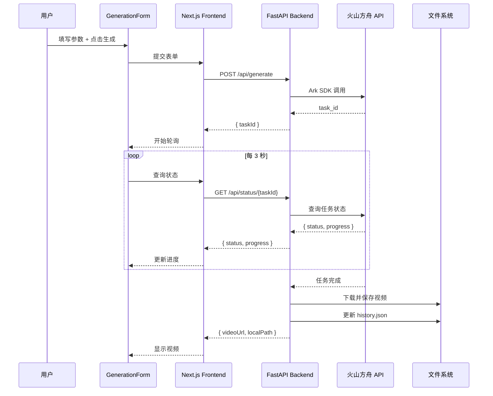

# Technical Design Document

## Overview

本设计文档描述 Seedance Video App 的技术架构和实现方案。该应用采用前后端分离架构，前端使用 Next.js 14，后端使用 FastAPI (Python)，集成火山引擎方舟（Volcengine Ark）官方 Seedance API，提供图生视频（image-to-video）和文生视频（text-to-video）两种视频生成模式。

### 核心技术栈

- **前端框架**: Next.js 14 (App Router) + Tailwind CSS
- **后端框架**: FastAPI (Python)
- **API 集成**: volcenginesdkarkruntime (Python SDK)
- **API 平台**: 火山引擎方舟（Volcengine Ark）
- **API Base URL**: https://ark.cn-beijing.volces.com/api/v3
- **环境变量**: ARK_API_KEY
- **视频存储**: 本地文件系统 (videos/)
- **历史记录**: JSON 文件存储

### 系统边界

```
┌─────────────────────────────────────────────────────────────┐
│                      Browser (Client)                        │
│  ┌─────────────┐  ┌─────────────┐  ┌─────────────────────┐  │
│  │GenerationForm│  │ VideoPlayer │  │    HistoryList      │  │
│  └──────┬──────┘  └──────┬──────┘  └──────────┬──────────┘  │
└─────────┼────────────────┼─────────────────────┼────────────┘
          │                │                     │
          ▼                ▼                     ▼
┌─────────────────────────────────────────────────────────────┐
│               Next.js Frontend (:3000)                       │
│  ┌──────────────────────────────────────────────────────┐   │
│  │              HTTP Requests to Backend                 │   │
│  └──────────────────────────────────────────────────────┘   │
└─────────────────────────┬───────────────────────────────────┘
                          │
                          ▼
┌─────────────────────────────────────────────────────────────┐
│                FastAPI Backend (:8000)                       │
│  ┌──────────┐  ┌──────────┐  ┌──────────┐  ┌──────────────┐ │
│  │/api/upload│  │/api/generate│ │/api/status│ │/api/history │ │
│  └─────┬────┘  └─────┬────┘  └─────┬────┘  └──────┬───────┘ │
└────────┼─────────────┼─────────────┼──────────────┼─────────┘
         │             │             │              │
         ▼             ▼             ▼              ▼
┌─────────────────────────────────────────────────────────────┐
│                    Backend Services                          │
│  ┌──────────────┐  ┌──────────────┐  ┌──────────────────┐   │
│  │ Volcengine   │  │ VideoStorage │  │   HistoryStore   │   │
│  │ Ark API      │  │ (local fs)   │  │ (history.json)   │   │
│  └──────────────┘  └──────────────┘  └──────────────────┘   │
└─────────────────────────────────────────────────────────────┘
```

---

## Architecture

### 整体架构

采用前后端分离架构，前端使用 Next.js 14 App Router，后端使用 FastAPI (Python)，通过 HTTP API 通信。



### 项目结构

```
seedance-video-app/
├── frontend/                 # Next.js 前端
│   ├── app/
│   │   ├── page.tsx
│   │   └── components/
│   ├── package.json
│   └── .env.local           # NEXT_PUBLIC_API_URL=http://localhost:8000
├── backend/                  # FastAPI 后端
│   ├── main.py
│   ├── routers/
│   │   ├── upload.py
│   │   ├── generate.py
│   │   ├── status.py
│   │   └── history.py
│   ├── services/
│   │   ├── video_generator.py
│   │   ├── video_storage.py
│   │   └── history_store.py
│   ├── requirements.txt
│   └── .env                 # ARK_API_KEY=xxx
└── videos/                   # 生成的视频存储目录
    └── history.json
```

### 数据流

#### 视频生成流程



---

## Components and Interfaces

### 前端组件 (Next.js)

#### 1. GenerationForm

负责参数配置和任务发起的核心表单组件。

```typescript
interface GenerationFormProps {
  onTaskStart: (taskId: string) => void;
  onTaskComplete: (result: VideoResult) => void;
  onError: (error: string) => void;
}

interface FormState {
  mode: 'text-to-video' | 'image-to-video';
  prompt: string;
  imageUrl: string | null;
  endImageUrl: string | null;
  aspectRatio: AspectRatio;
  resolution: Resolution;
  duration: number;
  cameraFixed: boolean;
  seed: number;
  generateAudio: boolean;
  enableSafetyChecker: boolean;
}
```

#### 2. VideoPlayer

视频播放组件，支持完整播放控制。

```typescript
interface VideoPlayerProps {
  src: string;
  resolution: string;
  duration: number;
  onError: () => void;
}
```

#### 3. HistoryList

历史记录列表组件。

```typescript
interface HistoryListProps {
  onSelect: (record: HistoryRecord) => void;
}
```

#### 4. ProgressDisplay

进度显示组件。

```typescript
interface ProgressDisplayProps {
  status: TaskStatus;
  progress: number; // 0-100
}
```

#### 5. API Client

前端 API 调用封装。

```typescript
// frontend/lib/api.ts
const API_BASE_URL = process.env.NEXT_PUBLIC_API_URL || 'http://localhost:8000';

export const api = {
  upload: (file: File) => fetch(`${API_BASE_URL}/api/upload`, { method: 'POST', body: formData }),
  generate: (params: GenerateRequest) => fetch(`${API_BASE_URL}/api/generate`, { method: 'POST', body: JSON.stringify(params) }),
  getStatus: (taskId: string) => fetch(`${API_BASE_URL}/api/status/${taskId}`),
  getHistory: () => fetch(`${API_BASE_URL}/api/history`),
  getVideo: (filename: string) => `${API_BASE_URL}/api/videos/${filename}`,
};
```

### 后端 API (FastAPI)

#### POST /api/upload

图片上传接口。

```python
# backend/routers/upload.py
from fastapi import APIRouter, UploadFile, File, HTTPException

router = APIRouter()

@router.post("/api/upload")
async def upload_image(file: UploadFile = File(...)):
    """
    上传图片文件，返回可访问的 URL
    
    Request: multipart/form-data
    - file: File (JPEG/PNG/WebP, max 10MB)
    
    Response:
    {
        "success": true,
        "url": "http://localhost:8000/api/uploads/xxx.jpg"
    }
    """
    pass
```

#### POST /api/generate

视频生成任务发起接口。

```python
# backend/routers/generate.py
from fastapi import APIRouter
from pydantic import BaseModel
from typing import Optional, Literal

router = APIRouter()

class GenerateRequest(BaseModel):
    mode: Literal['text-to-video', 'image-to-video']
    prompt: str
    image_url: Optional[str] = None
    end_image_url: Optional[str] = None
    aspect_ratio: str = "16:9"
    resolution: str = "720p"
    duration: int = 5
    camera_fixed: bool = False
    seed: int = -1
    generate_audio: bool = False
    enable_safety_checker: bool = False

class GenerateResponse(BaseModel):
    success: bool
    task_id: Optional[str] = None
    error: Optional[str] = None

@router.post("/api/generate", response_model=GenerateResponse)
async def generate_video(request: GenerateRequest):
    """发起视频生成任务"""
    pass
```

#### GET /api/status/{task_id}

任务状态查询接口。

```python
# backend/routers/status.py
from fastapi import APIRouter
from pydantic import BaseModel
from typing import Optional, Literal

router = APIRouter()

class StatusResponse(BaseModel):
    status: Literal['IN_QUEUE', 'IN_PROGRESS', 'COMPLETED', 'FAILED']
    progress: int  # 0-100
    video_url: Optional[str] = None
    local_path: Optional[str] = None
    error: Optional[str] = None

@router.get("/api/status/{task_id}", response_model=StatusResponse)
async def get_task_status(task_id: str):
    """查询任务状态"""
    pass
```

#### GET /api/history

历史记录查询接口。

```python
# backend/routers/history.py
from fastapi import APIRouter
from pydantic import BaseModel
from typing import List

router = APIRouter()

class HistoryRecord(BaseModel):
    task_id: str
    mode: str
    prompt: str
    aspect_ratio: str
    resolution: str
    duration: int
    local_path: str
    created_at: str
    thumbnail_path: Optional[str] = None

class HistoryResponse(BaseModel):
    records: List[HistoryRecord]

@router.get("/api/history", response_model=HistoryResponse)
async def get_history():
    """获取历史记录"""
    pass
```

#### GET /api/videos/{filename}

视频文件访问接口。

```python
# backend/routers/videos.py
from fastapi import APIRouter
from fastapi.responses import FileResponse

router = APIRouter()

@router.get("/api/videos/{filename}")
async def get_video(filename: str):
    """获取本地视频文件"""
    return FileResponse(f"videos/{filename}")
```

### 后端服务模块

#### VideoGenerator

封装火山引擎方舟 API 调用逻辑。

```python
# backend/services/video_generator.py
import os
from volcenginesdkarkruntime import Ark

class VideoGenerator:
    def __init__(self):
        self.client = Ark(
            base_url="https://ark.cn-beijing.volces.com/api/v3",
            api_key=os.environ.get("ARK_API_KEY"),
        )
    
    async def generate(self, params: dict) -> dict:
        """
        发起视频生成任务
        返回: { "task_id": str }
        """
        # 调用火山方舟 Seedance API
        # 具体调用方式待确认：
        # - client.videos.generate()
        # - 或通过 HTTP 直接调用
        pass
    
    async def get_status(self, task_id: str) -> dict:
        """
        查询任务状态
        返回: { "status": str, "progress": int, "video_url": str | None }
        """
        pass
```

#### VideoStorage

视频文件存储模块。

```python
# backend/services/video_storage.py
import os
import aiohttp
import aiofiles

class VideoStorage:
    def __init__(self, storage_dir: str = "videos"):
        self.storage_dir = storage_dir
        self.ensure_directory()
    
    def ensure_directory(self):
        """确保存储目录存在"""
        os.makedirs(self.storage_dir, exist_ok=True)
    
    async def download_and_save(self, video_url: str, task_id: str) -> str:
        """
        下载视频并保存到本地
        返回: 本地文件路径
        """
        filename = f"{task_id}.mp4"
        filepath = os.path.join(self.storage_dir, filename)
        
        async with aiohttp.ClientSession() as session:
            async with session.get(video_url) as response:
                async with aiofiles.open(filepath, 'wb') as f:
                    await f.write(await response.read())
        
        return filepath
```

#### HistoryStore

历史记录管理模块。

```python
# backend/services/history_store.py
import os
import json
import aiofiles
from typing import List
from datetime import datetime

class HistoryStore:
    def __init__(self, history_file: str = "videos/history.json"):
        self.history_file = history_file
    
    async def add_record(self, record: dict) -> None:
        """添加历史记录"""
        records = await self.get_records()
        record['created_at'] = datetime.now().isoformat()
        records.insert(0, record)
        
        async with aiofiles.open(self.history_file, 'w') as f:
            await f.write(json.dumps({"records": records}, ensure_ascii=False, indent=2))
    
    async def get_records(self) -> List[dict]:
        """获取所有历史记录"""
        if not os.path.exists(self.history_file):
            return []
        
        async with aiofiles.open(self.history_file, 'r') as f:
            content = await f.read()
            data = json.loads(content)
            return data.get("records", [])
```

---

## Data Models

### 类型定义

```typescript
// 画面比例
type AspectRatio = '21:9' | '16:9' | '4:3' | '1:1' | '3:4' | '9:16' | 'auto';

// 分辨率
type Resolution = '480p' | '720p' | '1080p';

// 任务状态
type TaskStatus = 'IN_QUEUE' | 'IN_PROGRESS' | 'COMPLETED' | 'FAILED';

// 生成模式
type GenerationMode = 'text-to-video' | 'image-to-video';
```

### 核心数据结构

```typescript
// 视频生成任务
interface Task {
  id: string;
  mode: GenerationMode;
  prompt: string;
  imageUrl?: string;
  endImageUrl?: string;
  aspectRatio: AspectRatio;
  resolution: Resolution;
  duration: number;
  cameraFixed: boolean;
  seed: number;
  generateAudio: boolean;
  enableSafetyChecker: boolean;
  status: TaskStatus;
  progress: number;
  createdAt: string;
  completedAt?: string;
  videoUrl?: string;
  localPath?: string;
  error?: string;
}

// 历史记录
interface HistoryRecord {
  taskId: string;
  mode: GenerationMode;
  prompt: string;
  aspectRatio: AspectRatio;
  resolution: Resolution;
  duration: number;
  localPath: string;
  createdAt: string;
  thumbnailPath?: string;
}

// 视频生成结果
interface VideoResult {
  taskId: string;
  videoUrl: string;
  localPath: string;
}
```

### 存储结构

#### history.json

```json
{
  "records": [
    {
      "task_id": "abc123",
      "mode": "text-to-video",
      "prompt": "A cat playing piano...",
      "aspect_ratio": "16:9",
      "resolution": "720p",
      "duration": 5,
      "local_path": "/videos/abc123.mp4",
      "created_at": "2024-01-15T10:30:00Z"
    }
  ]
}
```

### 火山方舟 API 参数映射

| 前端参数 | 后端参数 | 火山方舟参数 | 类型 | 默认值 |
|---------|---------|-------------|------|--------|
| prompt | prompt | prompt | string | (required) |
| imageUrl | image_url | image_url | string | (i2v required) |
| endImageUrl | end_image_url | end_image_url | string | null |
| aspectRatio | aspect_ratio | aspect_ratio | string | "16:9" |
| resolution | resolution | resolution | string | "720p" |
| duration | duration | duration | number | 5 |
| cameraFixed | camera_fixed | camera_fixed | boolean | false |
| seed | seed | seed | number | -1 |
| generateAudio | generate_audio | generate_audio | boolean | false |
| enableSafetyChecker | enable_safety_checker | enable_safety_checker | boolean | false |

### 火山方舟 SDK 调用示例

```python
from volcenginesdkarkruntime import Ark
import os

client = Ark(
    base_url="https://ark.cn-beijing.volces.com/api/v3",
    api_key=os.environ.get("ARK_API_KEY"),
)

# 视频生成调用方式待确认，可能是：
# - client.videos.generate()
# - 或者通过 HTTP 直接调用
```


---

## Correctness Properties

*A property is a characteristic or behavior that should hold true across all valid executions of a system—essentially, a formal statement about what the system should do. Properties serve as the bridge between human-readable specifications and machine-verifiable correctness guarantees.*

### Property 1: 模式切换保持共享参数不变

*For any* 表单状态和模式切换操作，切换模式后 prompt、aspectRatio、resolution、duration、cameraFixed、seed、generateAudio、enableSafetyChecker 参数值应与切换前完全相同。

**Validates: Requirements 1.4**

### Property 2: 模式决定图片上传区域可见性

*For any* 模式选择，当模式为 "image-to-video" 时图片上传区域应可见，当模式为 "text-to-video" 时图片上传区域应隐藏。

**Validates: Requirements 1.2, 1.3**

### Property 3: Prompt 长度限制

*For any* 输入字符串，如果长度超过 2000 个字符，系统应截断或拒绝该输入，确保最终 prompt 长度不超过 2000。

**Validates: Requirements 2.1**

### Property 4: 参数默认值正确性

*For any* 新创建的表单状态，所有参数应具有正确的默认值：aspectRatio="16:9"、resolution="720p"、duration=5、cameraFixed=false、seed=-1、generateAudio=false、enableSafetyChecker=false。

**Validates: Requirements 2.4, 2.5, 2.6, 2.7, 2.8, 2.9, 2.10**

### Property 5: 图片格式验证

*For any* 上传的文件，如果文件格式不是 JPEG、PNG 或 WebP，系统应拒绝上传并返回错误。

**Validates: Requirements 3.2**

### Property 6: 图片大小验证

*For any* 上传的文件，如果文件大小超过 10MB，系统应拒绝上传并返回错误。

**Validates: Requirements 3.3**

### Property 7: 上传成功返回有效 URL

*For any* 有效的图片文件（格式正确且大小不超过 10MB），上传成功后应返回一个可访问的 URL。

**Validates: Requirements 3.1**

### Property 8: 表单验证阻止无效提交

*For any* 表单状态，如果模式为 "image-to-video" 且 imageUrl 为空，或模式为 "text-to-video" 且 prompt 为空或纯空白字符，生成按钮应被禁用。

**Validates: Requirements 4.1, 4.2**

### Property 9: 生成请求包含所有参数

*For any* 有效的表单提交，发送到 /api/generate 的请求应包含所有配置参数（mode、prompt、image_url、end_image_url、aspect_ratio、resolution、duration、camera_fixed、seed、generate_audio、enable_safety_checker）。

**Validates: Requirements 4.3**

### Property 10: 任务进行中禁用重复提交

*For any* 正在进行的任务状态，生成按钮应被禁用，防止重复提交。

**Validates: Requirements 4.5**

### Property 11: 进度值正确显示

*For any* 进度值 p（0 ≤ p ≤ 100），UI 应正确显示该百分比数值和对应的进度条状态。

**Validates: Requirements 5.2**

### Property 12: 任务状态正确映射显示文字

*For any* 任务状态，IN_QUEUE 应显示 "排队中..."，IN_PROGRESS 应显示 "生成中..." 及进度百分比，COMPLETED 应停止轮询。

**Validates: Requirements 5.3, 5.4, 5.5**

### Property 13: 视频文件命名规范

*For any* 完成的任务，保存的视频文件名应为 `{taskId}.mp4`，存储路径应为 `videos/{taskId}.mp4`。

**Validates: Requirements 6.2**

### Property 14: 历史记录持久化

*For any* 成功保存的视频，history.json 应包含该任务的完整记录（taskId、mode、prompt、aspectRatio、resolution、duration、localPath、createdAt）。

**Validates: Requirements 6.3**

### Property 15: 历史记录渲染完整性

*For any* 历史记录项，渲染的卡片应包含：生成时间、模式、prompt 前 50 个字符。

**Validates: Requirements 8.2**

### Property 16: 历史记录按时间降序排列

*For any* 历史记录列表，记录应按 createdAt 降序排列，最新的记录排在最前。

**Validates: Requirements 8.4**

### Property 17: API 响应格式一致性

*For any* API 请求，响应应符合定义的接口格式：成功时包含预期数据字段，失败时包含 error 字段和适当的 HTTP 状态码。

**Validates: Requirements 9.2, 9.3, 9.4, 9.5**

---

## Error Handling

### 前端错误处理

| 错误场景 | 处理方式 | 用户提示 |
|---------|---------|---------|
| 图片格式不支持 | 拒绝上传，显示错误 | "仅支持 JPEG、PNG、WebP 格式图片" |
| 图片超过 10MB | 拒绝上传，显示错误 | "图片大小不能超过 10MB" |
| 未上传首帧图片 | 禁用生成按钮 | "请上传首帧图片" |
| Prompt 为空 | 禁用生成按钮 | "请输入提示词" |
| 生成任务失败 | 显示错误，恢复按钮 | 显示具体错误信息 |
| 轮询连续失败 3 次 | 停止轮询，显示错误 | "获取进度失败，请刷新页面重试" |
| 视频加载失败 | 显示错误，提供重试 | "视频加载失败" |
| 后端服务不可用 | 显示错误 | "后端服务暂时不可用，请稍后重试" |

### 后端错误处理

| 错误场景 | HTTP 状态码 | 响应内容 |
|---------|------------|---------|
| ARK_API_KEY 未配置 | 500 | `{ "error": "ARK_API_KEY 环境变量未配置" }` |
| 无效的请求参数 | 400 | `{ "error": "参数错误: {具体原因}" }` |
| 火山方舟 API 调用失败 | 502 | `{ "error": "视频生成服务暂时不可用" }` |
| 任务不存在 | 404 | `{ "error": "任务不存在" }` |
| 视频下载失败 | 500 | `{ "error": "视频保存失败", "fallback_url": "{原始URL}" }` |
| 文件系统错误 | 500 | `{ "error": "服务器内部错误" }` |

### 降级策略

1. **视频下载失败降级**: 保留火山方舟原始视频 URL，用户可手动下载
2. **历史记录加载失败**: 显示空状态，不阻塞主功能
3. **缩略图生成失败**: 使用默认占位图

---

## Testing Strategy

### 单元测试

#### 前端测试 (Jest + React Testing Library)

1. **组件测试**
   - GenerationForm 参数配置和验证逻辑
   - VideoPlayer 播放控制功能
   - HistoryList 渲染和交互
   - ProgressDisplay 进度显示

2. **工具函数测试**
   - 文件格式验证
   - 文件大小验证
   - 参数序列化
   - 历史记录排序

#### 后端测试 (pytest)

1. **API 路由测试**
   - 请求参数验证
   - 响应格式验证
   - 错误处理

2. **服务模块测试**
   - VideoGenerator 调用逻辑
   - VideoStorage 文件操作
   - HistoryStore 数据管理

### 属性测试

#### 前端属性测试 (fast-check)

每个属性测试运行至少 100 次迭代。

```typescript
// Feature: seedance-video-app, Property 1: 模式切换保持共享参数不变
test.prop([fc.record({...}), fc.constantFrom('text-to-video', 'image-to-video')])(
  'mode switch preserves shared parameters',
  (formState, newMode) => {
    const result = switchMode(formState, newMode);
    expect(result.prompt).toBe(formState.prompt);
    expect(result.aspectRatio).toBe(formState.aspectRatio);
    // ... 其他共享参数
  }
);

// Feature: seedance-video-app, Property 3: Prompt 长度限制
test.prop([fc.string({ maxLength: 5000 })])(
  'prompt length is limited to 2000 characters',
  (input) => {
    const result = validatePrompt(input);
    expect(result.length).toBeLessThanOrEqual(2000);
  }
);

// Feature: seedance-video-app, Property 5: 图片格式验证
test.prop([fc.constantFrom('gif', 'bmp', 'tiff', 'svg', 'pdf')])(
  'invalid image formats are rejected',
  (format) => {
    const file = createMockFile(format);
    expect(validateImageFormat(file)).toBe(false);
  }
);

// Feature: seedance-video-app, Property 8: 表单验证阻止无效提交
test.prop([fc.constantFrom('text-to-video', 'image-to-video'), fc.string()])(
  'form validation prevents invalid submissions',
  (mode, prompt) => {
    const isValid = validateForm({ mode, prompt: prompt.trim(), imageUrl: null });
    if (mode === 'text-to-video') {
      expect(isValid).toBe(prompt.trim().length > 0);
    } else {
      expect(isValid).toBe(false); // imageUrl is null
    }
  }
);

// Feature: seedance-video-app, Property 16: 历史记录按时间降序排列
test.prop([fc.array(fc.record({ createdAt: fc.date() }))])(
  'history records are sorted by createdAt descending',
  (records) => {
    const sorted = sortHistoryRecords(records);
    for (let i = 1; i < sorted.length; i++) {
      expect(new Date(sorted[i-1].createdAt).getTime())
        .toBeGreaterThanOrEqual(new Date(sorted[i].createdAt).getTime());
    }
  }
);
```

#### 后端属性测试 (hypothesis)

```python
# Feature: seedance-video-app, Property 16: 历史记录按时间降序排列
from hypothesis import given, strategies as st

@given(st.lists(st.fixed_dictionaries({
    'created_at': st.datetimes().map(lambda d: d.isoformat())
})))
def test_history_records_sorted_descending(records):
    sorted_records = sort_history_records(records)
    for i in range(1, len(sorted_records)):
        assert sorted_records[i-1]['created_at'] >= sorted_records[i]['created_at']
```

### 集成测试

1. **前端 API 集成测试**: 使用 MSW (Mock Service Worker) 模拟后端 API
2. **后端 API 集成测试**: 使用 pytest + httpx 测试 FastAPI 路由
3. **端到端测试**: 使用 Playwright 测试完整用户流程

### 测试配置

#### 前端 (package.json)

```json
{
  "jest": {
    "testEnvironment": "jsdom",
    "setupFilesAfterEnv": ["@testing-library/jest-dom"]
  },
  "fast-check": {
    "numRuns": 100
  }
}
```

#### 后端 (pytest.ini)

```ini
[pytest]
testpaths = tests
asyncio_mode = auto
```

#### 后端依赖 (requirements.txt)

```
fastapi>=0.104.0
uvicorn>=0.24.0
volcenginesdkarkruntime
aiohttp>=3.9.0
aiofiles>=23.2.0
python-multipart>=0.0.6
pydantic>=2.5.0
pytest>=7.4.0
pytest-asyncio>=0.21.0
httpx>=0.25.0
hypothesis>=6.92.0
```

